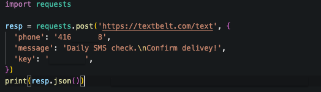

# SMS Delivery System

## Description
This is a Python script that automatically sends SMS to numbers in Canada and the US.  
The `system` was originally implemented at FPTV (where I work) to automate testing of the company's `SMS` receiving system.

## Table of Contents
- [Description](#description)
- [Usage](#usage)
- [License](#license)
- [Contributing](#contributing)
- [Tests](#tests)
- [Questions](#questions)

## Usage
The recommended use of this tool is as follows:
- Open the original script
- Edit the `number` field to use the desired `cellphone number`
- `Deploy` the edited script on your favorite `cloud` platform
- Alternatively, users can also `schedule` and `run` the script `locally`.

### Screenshot
Simple API request to send SMS:
 

## License
Licensed under the MIT license.
## Contributing
If you wish to contribute to the project you may submit PRs as needed.
## Tests
Testing can be made by editing the code to reflect the cellphone number you wish to send SMS content to. 
After editing the required information, you may `deploy` the script and `schedule` runs on your favorite `cloud` platform or you can run it `locally`.
## Questions
GitHub: [github.com/rfabreu](https://github.com/rfabreu)
 
Comments, suggestions, questions? Contact me at: [rafael.gomes@mail.utoronto.ca](mailto:rafael.gomes@mail.utoronto.ca)